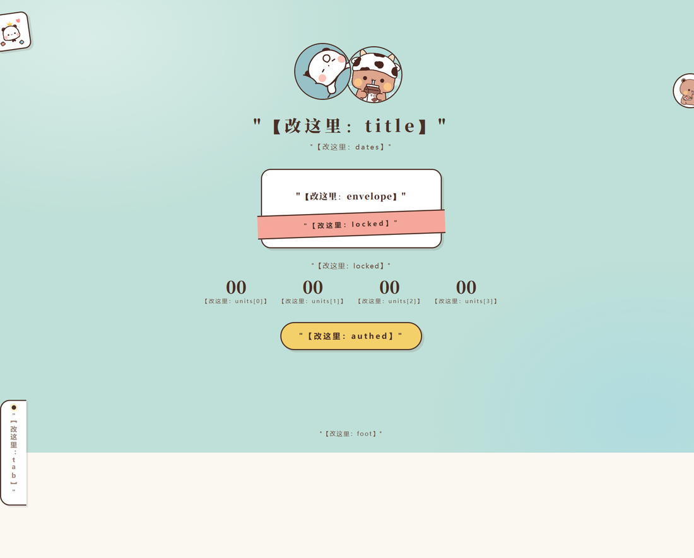
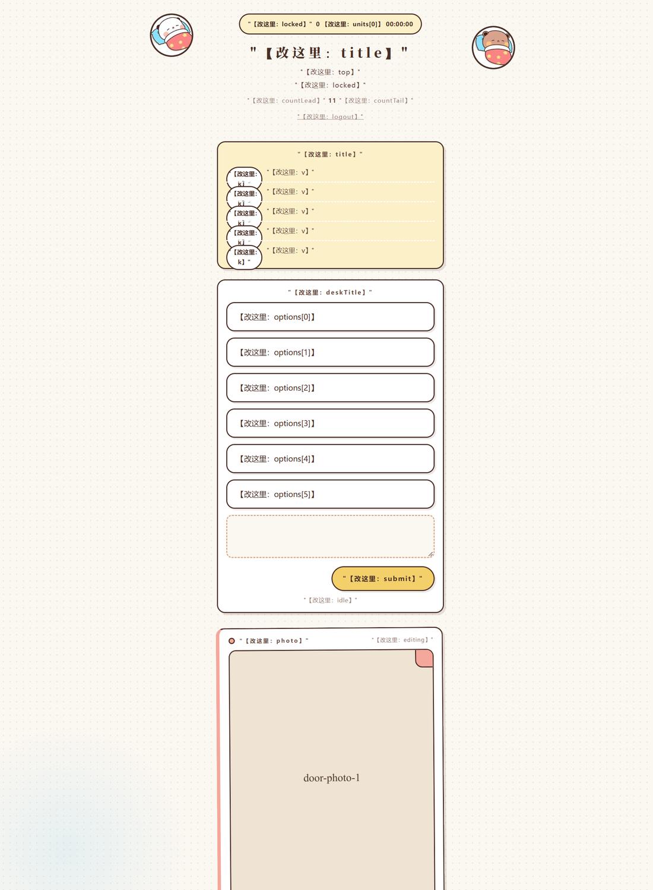

# 两周年纪念网页应用

> 两个人各自用「代号 + 对方的生日」进入同一个入口。开门时刻之前，界面上只有
> 属于自己的布置台；开门之后，同一个入口变成阅读流。

**这是一个纯净的开源版本**：里面没有你的照片、你的文案、你的生日。
按 [PLACEHOLDERS.md](./PLACEHOLDERS.md) 填完那 8 个位置，它就是你自己的礼物站。

## 你拿到的就是这个样子

下面这些截图是**这份纯净版自己跑起来**拍的（种子数据，不是任何真照片）。
满屏的 `【改这里：键名】` 就是**占位符**——它们精确地指出你要把自己的文案填在哪。
装上它、跑起它，第一眼看到的就是这个样子。

### 未开门：封印页 + 倒计时



### 未开门：布置台（留言 / 照片 / 预填选项）



### 开门后：同一个入口变成阅读流


### 阅读流：信与照片卡


### 阅读流的收尾：约定区


> 这几张图里的 `MK-…` 是 e2e 的标记（`docs/evidence/markers.json` 讲这套标记法），
> 意思是「这段内容来自种子数据」。你自己填完之后，它们就不在了。

技术栈：Node.js `>= 22.5`（ESM）+ Express + SQLite（Node 内置 `node:sqlite`）
+ multer + sharp。前端无框架、无打包工具，浏览器直接加载 `public/` 下的单页。
**除 Node 外没有构建步骤。**

---

## 它做什么

### 时间锁（这是整个项目的骨架）

开门时刻硬编码在 `src/clock.js` 的 `UNLOCK_AT`，不读设备时区、不读服务器时区，
换一台机器结论相同。

- 服务端在**所有路由之前**设一道闸门：未解锁时 `/api/shared`、`/api/wish` 的读请求
  一律 **404**。写请求放行 —— 约定要能提前折好，不挡写入。
- 未解锁时 `GET /api/entry` 只返回自己的条目，响应体里**没有对方的 id**；
  对方的照片经 `GET /api/photo/:id` 取同样是 **404**。
- 前端只认 `GET /api/status` 的 `unlocked`，且 **fail closed**：问不到就按没开。
  门关着时界面上不存在共同层或对方内容的任何占位。

### 布置台 / 阅读流

- **未解锁**：只有布置台 —— 信封墙，可写留言、上传照片、给每张照片配一句话、
  改配文、撤回。自己的内容只有自己看得到。
- **已解锁**：同一个入口切成阅读流 —— 先共同层九宫格，再对方的信、照片卡、
  收尾的一段话，最后双方约定的并排揭示。
- **两端同源**：布置台与阅读端共用 `public/app.js` 里同一个 `card(e, i, mode)`，
  `mode` 决定是否渲染撤回角标与操作区。各写各的早晚会长歪。

### 共同层

九张合照排成 3×3 九宫格，点开进放大层（环形翻页、计数、三种关闭方式、
打开时锁背景滚动），配一段关于这两年的文字。共同层只对两个人可见。

### 照片鉴权

- 照片文件落在 `$DATA_DIR/photos/`，目录权限 **700**，**绝不进 `public/`** 静态根。
- 服务启动时硬断言照片目录不在静态根之内（字面与 `realpathSync` 软链解析**各判一遍**），
  不满足**直接起不来**。宁可启动失败也不能悄悄开门。
- 图片字节只有一条出口：`GET /api/photo/:id`，带鉴权。

---

## 快速开始

前置：Node.js **>= 22.5**（`node:sqlite` 的下限）。

```bash
npm ci
npm run verify        # 规范验证入口 = check && test && boot
npm start             # 默认只绑 127.0.0.1，前面放 nginx 反代
```

| 脚本 | 验什么 |
|---|---|
| `npm run check` | 每个 `.js`/`.mjs` 都能解析；交给 Linux 执行的部署文件行尾必须是 LF；文案键完整性与 `public/copy.js` 漂移；秘密门禁（私钥 / 公网 IP / 完整生日口令 / SSH 主机别名 / 云实例 ID / 真实域名） |
| `npm test` | 全量测试（HTTP 缝 + 直查库缝 + jsdom 前端缝） |
| `npm run boot` | 依赖就位 + 服务真能起 + 时间锁闸门在关 + 默认绑定只走回环 |
| `npm run ops:check` | 线上只读体检（部署之后才用得上） |

> 原仓库的 `check` 还有第四段 `check-evidence.mjs`（校验 `docs/evidence/` 索引里的
> 数字与它索引的 JSON 实际一致）。**开源版没有那一段**，因为取证目录
> `docs/evidence/` 也不在包里 —— 那里面记的是**对某个真实域名跑过**的测试，
> 带着真实地址与部署细节。门禁与它的目录同进同出：没有证据可校，门禁就是空转。
> 你若要恢复它，把 `docs/evidence/` 与 `scripts/check-evidence.mjs` 一起加回来，
> 并在 `package.json` 的 `check` 里补上那个命令。

`./init.sh` 是同一批脚本的 bash 包装，供 Linux / 服务器 / 装了 node 的 WSL 使用。
**在 Windows + PowerShell 上跑它会 `exit 127`**，本机一律用 `npm run verify`。

文案改 `src/copy.js`，然后 `npm run build:copy` 生成 `public/copy.js` ——
页面加载的是**构建产物**，只改 `src/` 不重建，`npm run check` 会报漂移。

---

## ⚠️ 第一次 `npm test` 会有若干条红 —— 这是预期行为，不是包坏了

这份 Release 把 `src/copy.js` 里的**全部界面文案换成了 `【改这里：键名】`**。
于是**把「界面上必须出现那几个具体字」当抓手**的断言会跟着一起红。

**红多少条会随版本变**（它跟着占位符化范围走），所以这里**不写死数字** ——
以你自己那次运行为准：

```bash
npm test 2>&1 | grep -E "^ℹ (tests|pass|fail)"
```

（2026-10-06 对本包的一次实测是 52 条，落在若干个前端 / 导出 / 文案测试文件里。
**刻意不给逐文件分布表**：那个统计的覆盖口径不稳 —— 按失败块归属会漏掉一部分
异步断言，写死它只会变成下一个会自己漂的数字。）

要看的不是「红」，是**红在哪**：失败信息会直接告诉你期望的是哪几个字，例如
`BGM：开关关掉 → 真的停、按钮变「音 乐 关」`、`引导里没有开门日期「10 月 5 日」`、
`应急页的标签页标题与正式站同一个词`。

那些用例守的是**产品行为**——音乐真的停、引导真的有五条、九宫格破图时真的是占位块、
空库导出真的不炸。文案只是它们的**抓手**：抓手换成 `【改这里：…】`，断言就抓空了。

**怎么办**：按 [PLACEHOLDERS.md](./PLACEHOLDERS.md) 填完自己的文案之后，
把失败输出里点名的那些**具体字**换成你自己的。
注意别只无脑改期望值：有几条同时断言「行为」与「词」（音乐停下是行为、
按钮写什么字是词），改完词之后**顺手确认那条行为断言仍然成立**。

**`npm run check` 与 `npm run boot` 在本包里是全绿的**（实测，`boot` 退出码 0）
—— 它们只查键齐不齐、构建产物有没有漂移、服务起不起来，**不咬具体文案**。

所以这两种红的处理方式完全不同：

- **只有 `test` 红** → 你还没把文案换成自己的，正常，按上面改期望值。
- **`check` 或 `boot` 红** → 你真的弄坏了什么，去查。

别把后者当前者处理，也别把前者当后者去查。

---

## 项目结构

| 路径 | 职责 |
|---|---|
| `src/` | 后端：应用工厂、路由、SQLite 访问层、鉴权、照片处理、开门时钟、运维日志 |
| `public/` | 公开静态资源：单页、样式、前端脚本、文案构建产物、站点美术素材；无鉴权直出 |
| `test/` | `node --test` 测试 |
| `scripts/` | 门禁脚本、运维体检、Release 构建与自检、e2e |
| `deploy/` | systemd unit、部署脚本、端口探测、env 模板、测试实例、nginx 配置 |
| `CONSTRAINTS.md` | **质量基线：什么算对**，以及不得放宽的约束 |
| `.gitignore` | 已挡掉 `photos/` 与 `data/` —— **别绕过它** |

---

## 数据与隐私设计

- **口令不进库。** 口令是「对方的生日」，只以 scrypt 加盐哈希存进
  `person.pw4` / `person.pw8`（4 位月日与 8 位完整生日两种形态各存一条），
  比对走 `timingSafeEqual`。
- **照片不进静态根。** 库里只存元数据（mime / 字节数 / 宽高），唯一的读图路径带鉴权。
- **未解锁时读不到。** 共同层与约定 404、对方条目不出现在列表里、对方的照片 404、
  猜静态路径同样 404。这是**服务端属性**，不是前端藏起来。
- **会话是短期凭据。** token 32 字节随机，`httpOnly` + `SameSite=Lax` cookie，
  **不加正的** `Max-Age` / `Expires`；`Secure` 按这一条连接是否加密决定；
  永不加 `Domain`。
- **浏览器不许替你记住生日。** 生日必须每次亲手敲 —— 那正是这个东西存在的理由。
- **BGM 缺失不会自动隐藏音乐按钮。** `public/app.js` 无条件建 `<audio src="/bgm.mp3">`，
  文件不在时按钮照常显示、点了不响。要么放自己的 mp3，要么把 `copy.js` 的
  `music.*` 与按钮一起去掉（见 [PLACEHOLDERS.md](./PLACEHOLDERS.md)）。
- **限流共用一张表。** 同 IP 登录失败 5 次锁 10 分钟。
- **全站只用代号**，不出现真名。
- **运行期数据不入版本库。** `data/`（SQLite 库 + 照片目录）与 `photos/`
  （你的合照）在 `.gitignore` 里并有门禁断言。

诚实的边界：数据库文件在服务器磁盘上，机器主人技术上可以直接读。
这个应用靠信任，不靠物理隔离。

---

## 运维

`npm run ops:check` 是**只读**的线上体检，一个命令回答「服务还好不好」：
进程答不答话、开门状态对不对、闸门有没有被翻掉、照片有没有被静态直出、
库的不变量（限流表为 0、哨兵在、零测试标记）、照片目录权限、日志占用。

它不改任何配置、不写库、不重启服务。退出码 `0` 全绿 / `1` 有问题 /
`2` **体检脚本自己坏了**（与服务状态无关）。

部署细节看 `deploy/` 里的 systemd unit、`deploy.sh`（默认 dry-run，
要 `--execute` 才动手）与 `two-years.env.example`。
两条部署门禁在本机跑（它们是 bash 脚本）：

```bash
npm run check:env-expand    # 挡 eval 转义：命令在数组里 eval 一次，值会不对
npm run check:node-source   # 挡「守卫查错了对象」：PATH 上的 node 与 unit 里的可能不是同一个
```

---

## 二次开发

按 [PLACEHOLDERS.md](./PLACEHOLDERS.md) 填。动手前读
[CONSTRAINTS.md](./CONSTRAINTS.md) —— 它写的是「什么算对」，
**不要为了让某个改动通过而放宽里面任何一条**。
放宽一条约束 = 撤销了它保护的东西，必须在同一次提交里说明理由。
